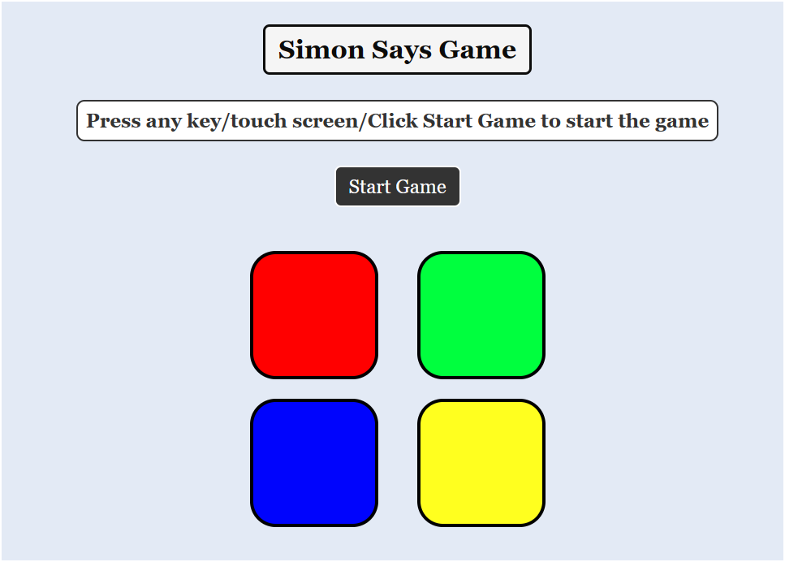

# Simon Says Game

## Introduction
Simon Says Game is a classic memory game where players must repeat a sequence of colors and sounds in the same order that the game presents them. The game starts by displaying a sequence of colors, which the player must then repeat. With each successful repetition, the sequence becomes longer and more challenging.

## Features
- Start the game by pressing any key, touching the screen, or clicking the "Start Game" button.
- Watch a tutorial video on how to play the game.
- Test your memory and concentration skills as you progress through levels.
- Compete for the highest score and try to beat your previous record.
- Responsive design for optimal gameplay on various devices.

## Technologies Used
- HTML
- CSS
- JavaScript

## How to Play
1. Start the game by pressing any key, touching the screen, or clicking the "Start Game" button.
2. Pay attention to the sequence of colors displayed by the game.
3. Repeat the sequence by clicking on the colored buttons in the same order.
4. The game will continue to increase the sequence length with each successful repetition.
5. If you make a mistake or fail to repeat the sequence correctly, the game will end.

## Demo
[Play the game](https://hardiksrivatavaa.github.io/Simon-Says-Game/)

## Preview

## Author
[Hardik Srivastava](https://github.com/hardik-techie)

